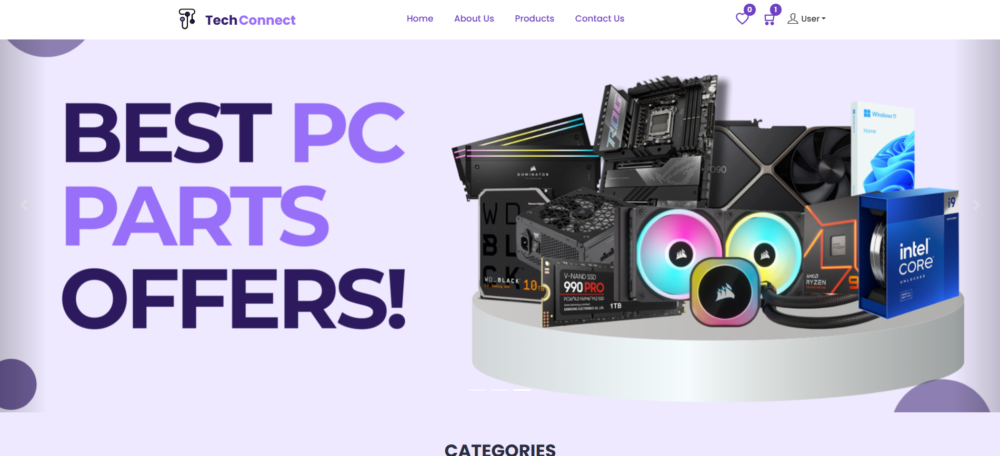
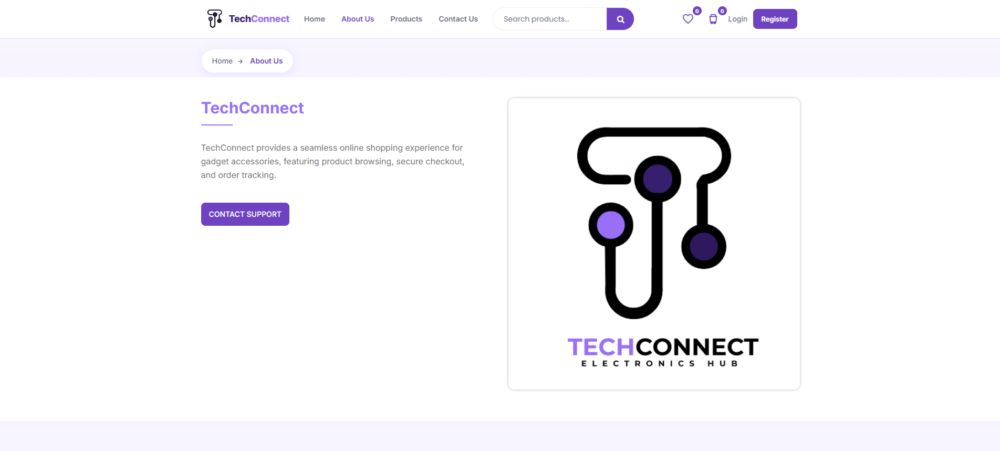
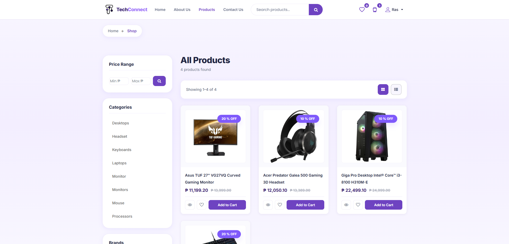
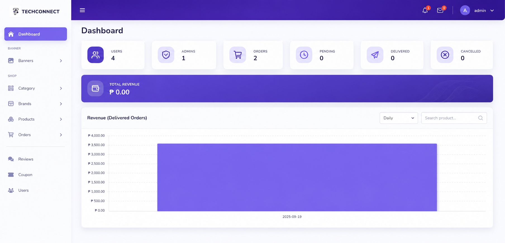

<p align="center">
  
</p>

<h2 align="center">TechConnect E-Commerce & Inventory System</h2>

---

## 📌 Info
TechConnect is a Laravel-based e-commerce and inventory system designed for electronics and accessories. It enables users to browse products, add items to cart, and place orders with automated email PDF receipts. Administrators can manage inventory, monitor sales, and generate reports through a centralized dashboard.

---

## 🚀 Features
- Product browsing and catalog system  
- Shopping cart and checkout process  
- Automated email PDF receipt generation  
- Inventory and stock management  
- Admin dashboard with sales analytics  
- Sales tracking and reporting  
- Product and category management  
- User authentication and role-based access  

---

## 🧠 Tech Stack
- **Backend:** PHP (Laravel)  
- **Frontend:** HTML, CSS, JavaScript  
- **Database:** MySQL  
- **Tools:** XAMPP / Laragon  

---

## 🖼️ Screenshots

### Home / Banner


### About Page


### Products Page


### Admin Dashboard


---

## ⚙️ Installation & Setup

### 1. Clone the Repository
```bash
git clone https://github.com/rass-dev/TechConnect.git
cd TechConnect
````

### 2. Install Dependencies

```bash
composer install
```

### 3. Setup Environment File

```bash
cp .env.example .env
```

### 4. Configure Database

Open `.env` file and update:

```env
DB_DATABASE=your_database_name
DB_USERNAME=root
DB_PASSWORD=
```

### 5. Initialize Application

```bash
php artisan key:generate
php artisan migrate
```

*(Optional)*

```bash
php artisan db:seed
```

### 6. Start the Server

```bash
php artisan serve
```

---

## ▶️ Usage

### Access the system:

[http://127.0.0.1:8000](http://127.0.0.1:8000)

**User**

* Browse products
* Add to cart
* Checkout
* Receive email receipt

**Admin**

* Manage products and categories
* Monitor sales
* View reports and dashboard

---

## 🔐 Notes

* Make sure XAMPP/Laragon and MySQL are running
* Ensure `.env` is properly configured
* Email feature may require mail setup

