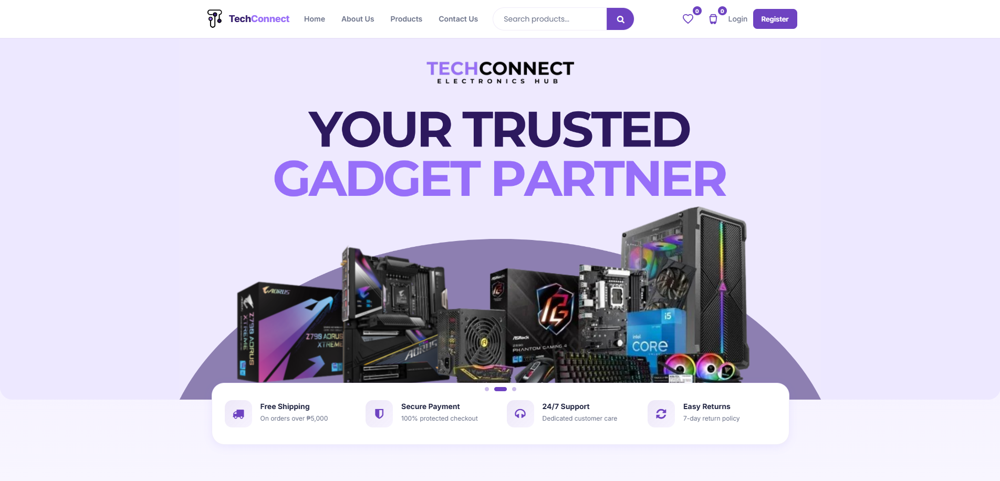
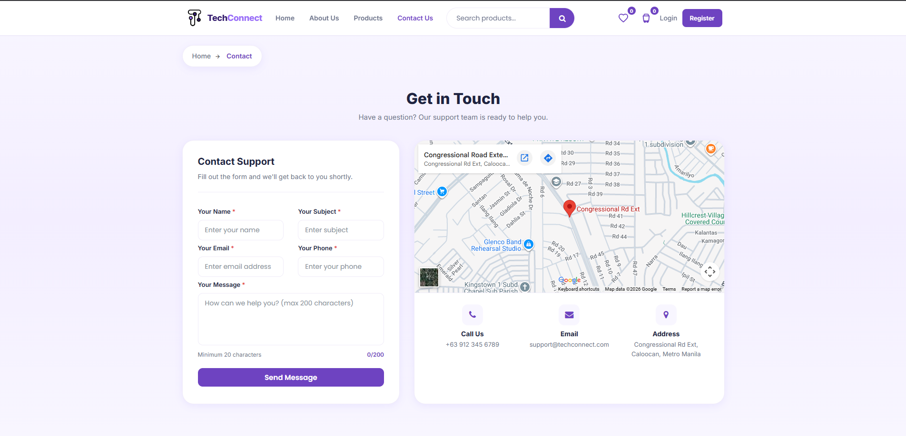
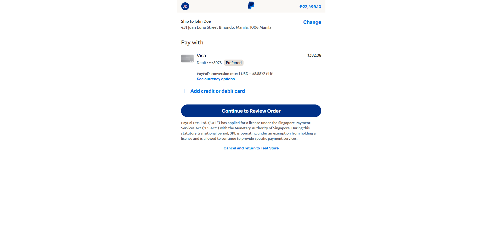
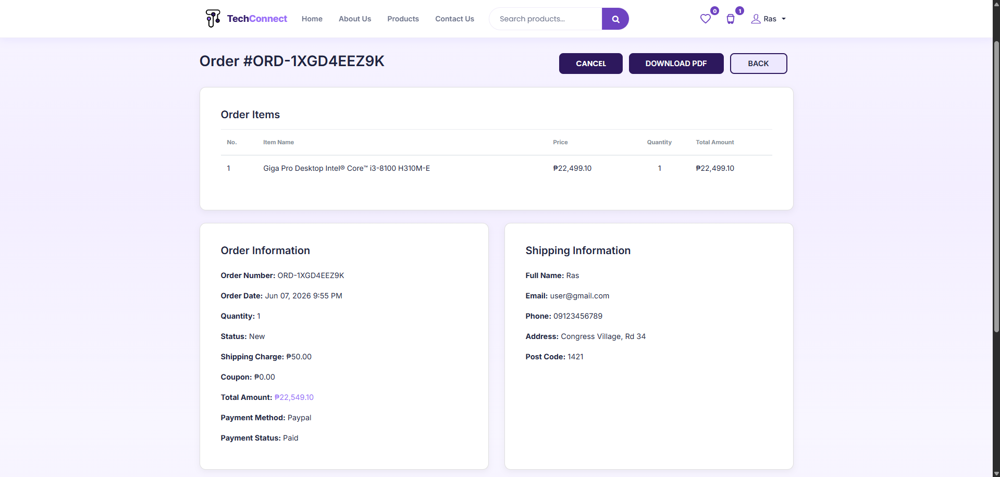
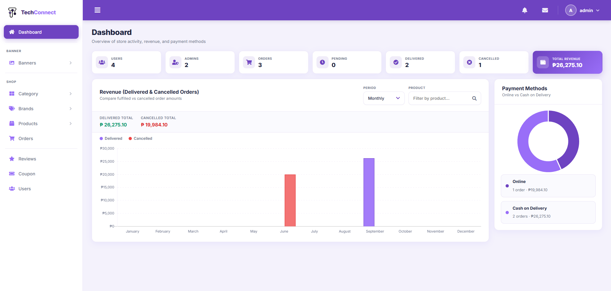

````md
<p align="center">
  
</p>

<h2 align="center">TechConnect E-Commerce & Inventory System</h2>

---

## Overview

TechConnect is a Laravel-based e-commerce and inventory system designed for electronics and accessories. It enables users to browse products, add items to their cart, and place orders with automated email PDF receipts. Administrators can manage inventory, monitor sales, and generate reports through a centralized dashboard.

---

## Features

- Product browsing and catalog system
- Shopping cart and checkout process
- Automated email PDF receipt generation
- Inventory and stock management
- Admin dashboard with sales analytics
- Sales tracking and reporting
- Product and category management
- User authentication and role-based access

---

## Tech Stack

- **Backend:** PHP (Laravel)
- **Frontend:** HTML, CSS, JavaScript
- **Database:** MySQL
- **Tools:** XAMPP / Laragon

---

## 🖼️ Screenshots

### Logo


Represents the official branding and identity of the TechConnect E-Commerce & Inventory System.

---

### Home Page



Serves as the main landing page, showcasing featured products, promotions, and store services.

---

### About Page


Displays information about TechConnect, including its purpose, features, and company branding.

---

### Products Page


Allows users to browse products and filter them by category, brand, and price range.

---

### Contact Page



Enables customers to send inquiries and view the company's contact details and location.

---

### PayPal Checkout Page



Displays the PayPal payment gateway where users can securely complete their purchases.

---

### Order Details Page



Shows the complete order summary, shipping information, payment status, and purchased items.

---

### Admin Dashboard



Provides administrators with an overview of users, orders, revenue, and payment analytics.

---

## Installation & Setup

### 1. Clone the Repository

```bash
git clone https://github.com/rass-dev/TechConnect.git
cd TechConnect
```

### 2. Install Dependencies

```bash
composer install
```

### 3. Setup Environment File

```bash
cp .env.example .env
```

### 4. Configure Database

Open the `.env` file and update:

```env
DB_DATABASE=techconnect
DB_USERNAME=root
DB_PASSWORD=
```

---

### 4.1 Import Database (Recommended)

A ready-to-use database backup is included in the project.

1. Open **phpMyAdmin**
2. Create a database named **techconnect**
3. Go to the **Import** tab
4. Select the SQL file:

```
TechConnect/techconnect_backup.sql
```

5. Click **Import**

---

### 5. Initialize Application

```bash
php artisan key:generate
```

*(Skip migration if using the provided database.)*

```bash
php artisan migrate
```

*(Optional)*

```bash
php artisan db:seed
```

---

### 6. Start the Server

```bash
php artisan serve
```

---

## Usage

### Access the system

```
http://127.0.0.1:8000
```

### User

- Browse products
- Add items to cart
- Checkout orders
- Receive email PDF receipts

### Administrator

- Manage products and categories
- Monitor sales
- Manage inventory
- View reports and dashboard analytics

---

## 🔐 Notes

- Make sure XAMPP or Laragon and MySQL are running.
- Ensure the `.env` file is properly configured.
- A ready-to-use database backup is included with the project.
- Email functionality may require additional mail configuration.
- PayPal integration may require API credentials for production use.

---

## Developer

**Ras D.P. Sanchez**

Bachelor of Science in Information Technology

GitHub: https://github.com/rass-dev
````
